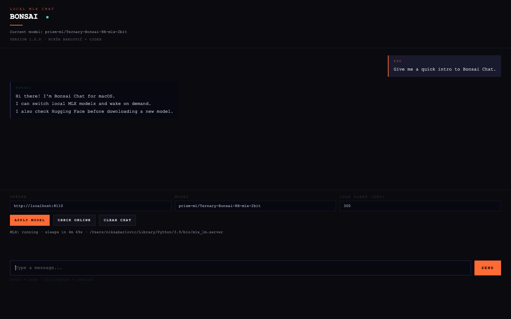

# Bonsai Chat for macOS

Version: `1.0.0`

Signed by: `Nikša Barlović + Codex`

Local chat UI for `mlx_lm.server` with:

- model switching from the browser UI
- Hugging Face online model lookup
- "download and apply" flow for uncached models
- automatic idle sleep so MLX does not stay hot forever
- macOS packaging via PyInstaller

## Screenshot



## Files

- `bonsai.py`: local HTTP app and MLX process manager
- `bonsai-chat.html`: browser UI
- `scripts/build-macos.sh`: build script for the macOS executable, app bundle, and DMG

## Requirements

- macOS
- `python3`
- `mlx-lm`
- `huggingface_hub`
- `pyinstaller` for packaging

Install the Python dependencies:

```bash
python3 -m pip install --user mlx-lm huggingface_hub pyinstaller
```

## Run from source

```bash
python3 bonsai.py
```

The app opens on `http://localhost:8080`.

## Build macOS artifacts

```bash
./scripts/build-macos.sh
```

Build output goes to `release/`.

## Notes

- The packaged app still expects `mlx_lm.server` to be available on the Mac.
- App config is stored in `~/Library/Application Support/BonsaiChat/config.json`.
- Logs are stored in `~/Library/Application Support/BonsaiChat/bonsai.log`.
